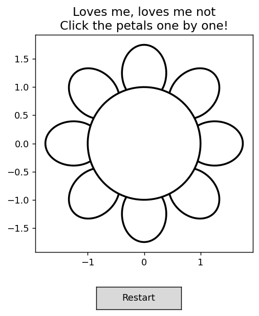
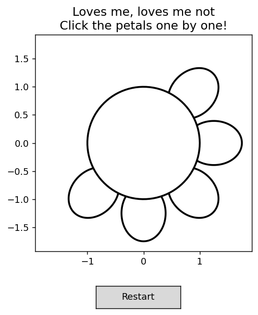
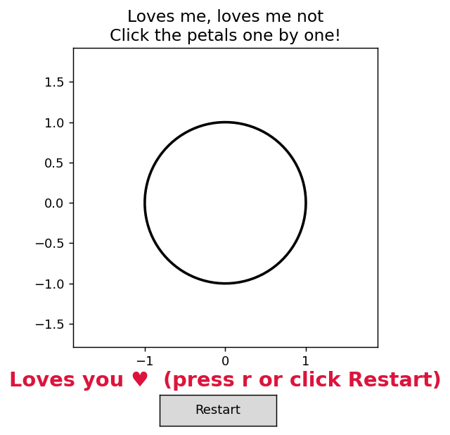

# Loves Me, Loves Me Not 🌸
 
A small interactive game built with `matplotlib`. A flower with a random
number of petals (5–13) is drawn on screen — click the petals one by one to
pluck them. When the last petal falls, the plot reveals whether it's
"Loves you" (odd number of petals) or "Loves you not" (even number of
petals).
 
|  Start  |  Mid-game  |  Finished  |
|:---:|:---:|:---:|
|  |  |  |
 
## How it works
 
- `flower.py` — the `Flower` class draws the center and petals as
  matplotlib patches and hands back references to them for hit-testing.
- `game.py` — sets up the figure, wires up a `button_press_event` click
  handler that finds which petal (if any) was clicked, removes it, and
  shows the result as text on the plot once all petals are gone.
## Run it
 
```bash
pip install -r requirements.txt
python game.py
```
 
Click each petal until none remain — the answer appears right on the plot.
 
To play again, either click the **Restart** button under the flower or
press the **`r`** key at any time — both draw a brand-new flower with a
freshly randomized petal count.
 
## Notes
 
- Clicking the white center of the flower does nothing.
- Each click can only remove one petal (the one you actually clicked).
- Restarting works whether the current round is finished or still in
  progress.